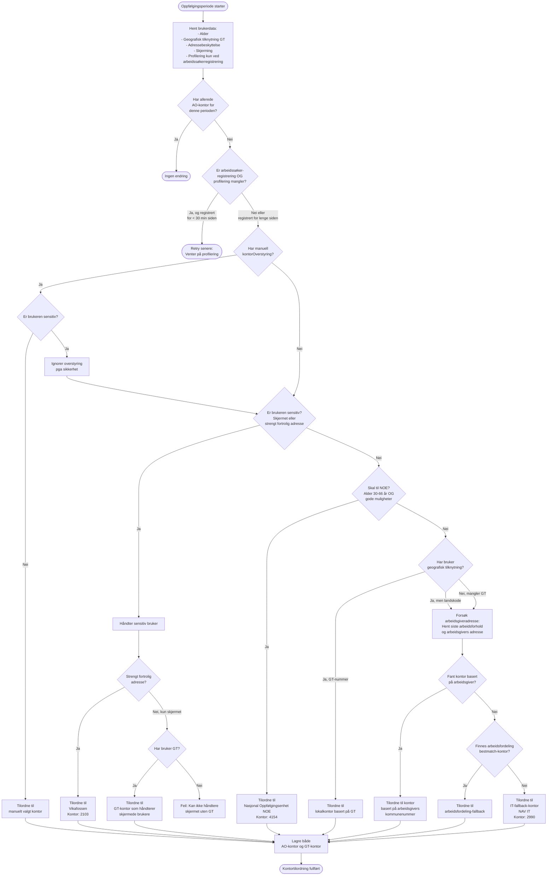
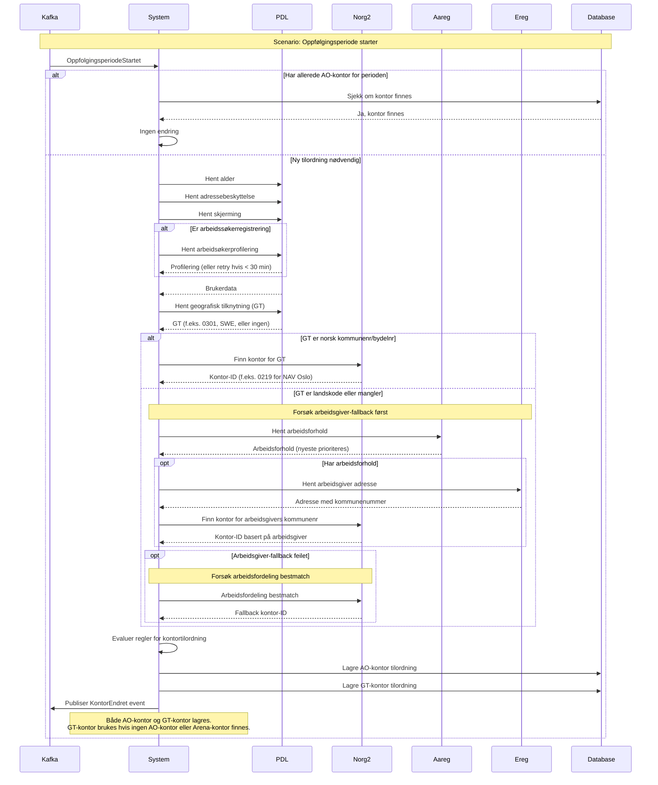

# ao-oppfolgingskontor
Oppfølgingskontor for Arbeidsrettet Oppfølging

## Inbound data
| Endepunkt                              | Beskrivelse                                                       |      
|----------------------------------------|-------------------------------------------------------------------|
| `POST /api/kontor`                     | Setter arbeidsoppfolgings-kontor for en bruker (Kontortilordning) |
| `pto.endring-paa-oppfolgingsbruker-v2` | Alle oppfolgingskontor fra arena                                  |
| `Liste over Kontor fra Norg`           | Henter liste over kontor fra Norg2                                |

## Ubiquitous language
- **Arbeidsoppfolging-kontor**: Alltid satt manuelt av veileder (foreløpig)
- **Arena-kontor**: satt enten manuelt eller automatisk i Arena
- **Geografisk-tilknyttet-kontor**: Kontor som tilhører brukers folkeregistrerte adresse
  - Gitt en geografisk tilknytning (GT), sjekk i Norg2 hvilket kontor som er tilknyttet den GT-en
- **Kontortilhørighet**: hvilket kontor en bruker tilhører
  - Kan være arbeidsoppfølging-kontor, arena-kontor eller GT-kontor
  - Kan være flere kontortilhørigheter samtidig men kun én av hver type
  - Har prioriteringsrekkefølge: arbeidsoppfølging-kontor (viktigst) > arena-kontor > GT-kontor
- **Kontortilordning**: handlingen å sette kontoret til en bruker, kan være manuelt eller automatisk. Alle tre kontortyper kan settes. Inneholder hvem som utførte handlingen (system eller veileder-ident) og tidspunkt for når kontoret ble satt.
  - AOKontorEndret
    - KontorSattAvVeileder
    - OppfolgingsPeriodeStartetLokalKontorTilordning
    - OppfolgingsperiodeStartetNoeTilordning
  - ArenaKontorEndret
    - EndringPaaOppfolgingsBrukerFraArena
  - GTKontorEndret
    - Ingen foreløpig :(

## Business rules
- Arbeidsoppfølgings-kontor > Arena-kontor > GT-kontor. 
- kontorForBruker gir ut kontoret med høyest prioritet.

## Outbound data
| Endepunkt                    | Beskrivelse                                                                                                                 |      
|------------------------------|-----------------------------------------------------------------------------------------------------------------------------|
| `/graphql (alleKontor)`      | Liste over alle kontor som kan velges når man skal sette kontor                                                             |
| `/graphql (kontorForBruker)` | Nåværende, høyest prioriterte **Kontortilhørighet**. Returnerer ett en tilhørighet men kontoret kan være av alle tre typene |
| `/graphql (kontorHistorikk)` | Alle historiske **Kontortilhørighet**-er                                                                                    |
| `topic for kontorendringer`  | Alle endringer? Bare "overstyringer"? Bare Arena + arbeidsoppfølging?                                                       |

## Automatisk kontortilordning - forklaring

### Beslutningsflyt for automatisk tilordning

### Kriterier for Nasjonal Oppfølgingsenhet (NOE)
Brukere blir rutet til NOE (kontor 4154) når **alle** følgende kriterier er oppfylt:
- Alder mellom 30 og 66 år (inkludert 30 og 66)
- Profilering viser "antatt gode muligheter"
- Brukeren er **ikke** skjermet
- Brukeren har **ikke** strengt fortrolig adresse
- Ingen manuell kontorOverstyring er satt

### Eksempler på kontortilordning

| Brukertype | Alder | GT | Skjermet | Adressebeskyttelse | Profilering | Manuell overstyring | Resultat |
|------------|-------|-----|----------|-------------------|-------------|---------------------|----------|
| Ung med gode muligheter | 25 | 0301 | Nei | Nei | Gode muligheter | Nei | **Lokalkontor** (Oslo) |
| Eldre med gode muligheter | 40 | 5001 | Nei | Nei | Gode muligheter | Nei | **NOE** (4154) |
| Voksen med behov for veiledning | 35 | 1103 | Nei | Nei | Behov for veiledning | Nei | **Lokalkontor** (Stavanger) |
| Strengt fortrolig | 30 | 0301 | Nei | Ja, kode 6 | Gode muligheter | Nei | **Vikafossen** (2103) |
| Skjermet bruker | 45 | 5001 | Ja | Nei | Gode muligheter | Nei | **Lokalkontor** med skjerming (Trondheim) |
| Mangler GT | 28 | - | Nei | Nei | Behov for veiledning | Nei | **IT-fallback** (NAV IT, 2990) |
| Bor i utlandet, arbeidsgiver-fallback | 32 | SWE | Nei | Nei | Gode muligheter | Nei | **Kontor basert på arbeidsgiver** (f.eks. 0219 hvis arbeidsgiver i Oslo) |
| Bor i utlandet med bestmatch-fallback | 32 | SWE | Nei | Nei | Gode muligheter | Nei | **Arbeidsfordeling-fallback** |
| Manuell overstyring akseptert | 40 | 5001 | Nei | Nei | Gode muligheter | Ja, kontor 7777 | **Kontor 7777** (overstyrer NOE) |
| Manuell overstyring ignorert | 45 | 5001 | Ja | Nei | Gode muligheter | Ja, kontor 9999 | **Lokalkontor** (Trondheim, ignorerer 9999 pga skjerming) |
| Strengt fortrolig med overstyring | 30 | 0301 | Nei | Ja, kode 6 | Gode muligheter | Ja, kontor 8888 | **Vikafossen** (2103, ignorerer 8888 pga sikkerhet) |

### Hendelser som trigger oppdatering av kontortilhørighet

## Built with
- Kotlin
- [Ktor (v3)](https://ktor.io/docs/welcome.html)
- [graphql-kotlin (expedia)](https://opensource.expediagroup.com/graphql-kotlin/docs/)
- [Kafka Streams](https://kafka.apache.org/documentation/streams/)
- [Exposed](https://www.jetbrains.com/help/exposed/home.html)

[Link til GraphiQl](https://ao-oppfolgingskontor.intern.dev.nav.no/graphiql)
